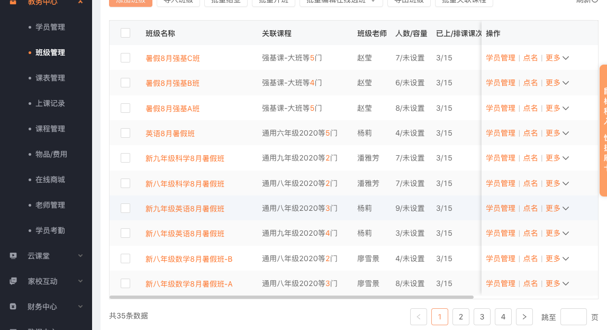
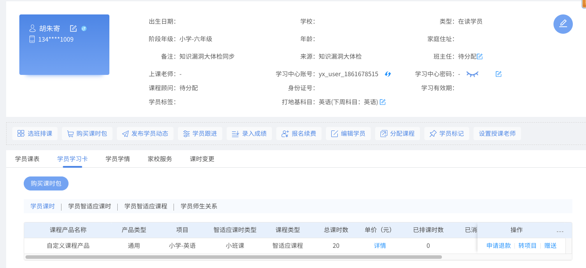

# 2.教学

## 2.1 课前：

  ##### 2.1.1排课&通知：  
      
    老师使用“小麦助教”为了所属自己的学生排课，并且，每周上课前通知家长，如果，学员本周需要请假则再做调整。  

  ##### 2.1.2备课：  
    虽然强基班在大部分时间内学员都是处于自学状态，老师仍需熟练掌握小学课程知识点之间联系。 

  ##### 2.1.3课时购买:
        
    在校区运营系统上，为学员账号充值  

  ##### 2.1.4课程分配:   
    在校区运营系统上，为学员分配相应课程    

## 2.2课中：
  ##### 2.2.1安排座位:  
    让自控较差的学员单独坐， 拆散熟人，学习力较弱做在老师身边。  最大限度减少相互干扰。
  ##### 2.2.2监督:  
    确保每位学员沉浸在学习中， 指导学员操作，及时排除设备故障。 组织学员一起做眼保健操。 
  ##### 2.2.3记录：  
    让每位同学将当天的学习结果（章节名称，学前，学后等信息）填入表中。

## 2.3课后： 
  - ##### 2.3.1反馈:  
    

  - ##### 2.3.2统计&分析:  
    - 使用教师端，分析所有学员的打地基数据，标注进度过慢的学员，记录优秀学生。

  - ##### 2.3.3学员沟通:  
    - 方式： 电话 or 面谈  
    - 老师和学员面对面交谈，告知学员当前的学习状态及学习进度， 对优点一定要表扬。 以鼓励为主，激发学员的学习动力。适当给予改进意见。   
  
  - ##### 2.3.4家长沟通:  
    - 方式： 电话 or 面谈  
    - 老师和学员面对面交谈，告知学员当前的学习状态及学习进度， 对优点一定要表扬。 以鼓励为主，激发学员的学习动力。适当给予改进意见。 
  
  - ##### 2.3.5家长会:  
    - 方式： 电话 or 面谈  
    - 老师和学员面对面交谈，告知学员当前的学习状态及学习进度， 对优点一定要表扬。 以鼓励为主，激发学员的学习动力。适当给予改进意见。 
  
  